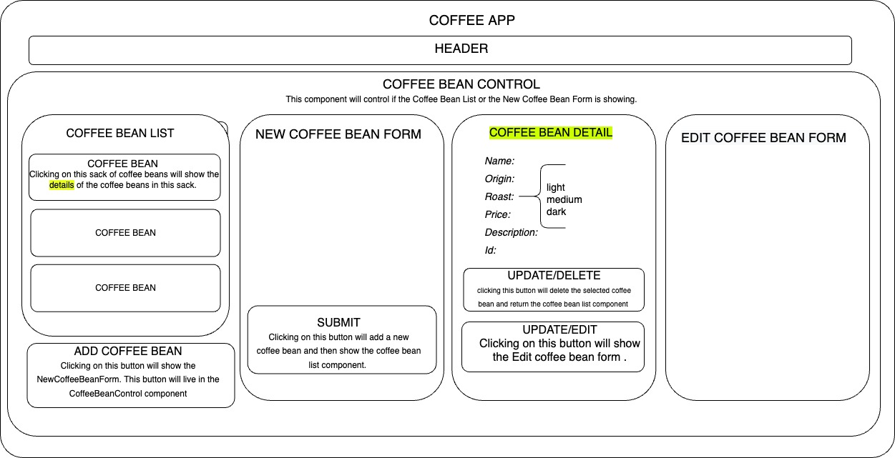

# Caro Coffee 

### By Caroline Cerussi

## Description:

This application is an inventory tracker for a coffee roaster's business. It has CRUD functionality- allowing the user to create a new type of coffee bean, including a full description with a few different properties. When adding the new type, you are redirected to the home page, where you will see the name of the new coffee bean in a list format. Click each to see information - including bean name, origin, roast level, flavor description, price per pound, and quantity.  A sell method changes the quantity -1 each time a bag is sold. At any time, you can edit the information within the coffee bean type, or delete the whole object altogether from the log. 

## Technologies Used: 

* Node
* JavaScript
* CSS
* React
* Bootstrap
* Babel
* Es-Linter

## Diagram 

## Setup & Installation Requirements

*  Clone this repository from https://github.com/carolinecerussi/Caro-Coffee to your desktop

*  Navigate to the top level of the dir* In your terminal console: $cd to carocoffee directory

*  $npm install

*  $npm run start to open in web browser http://localhost:3000

## Known Bugs

None :) 

### License 

copyright (c) 9-9-2022 Caroline Cerussi